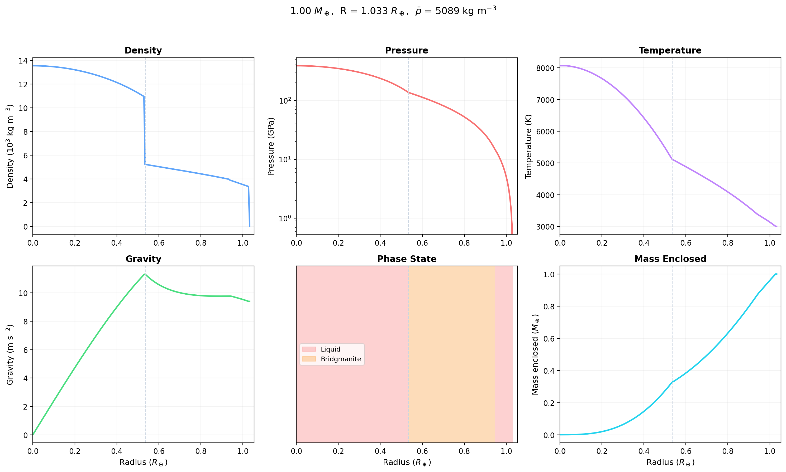

[](https://codecov.io/gh/FormingWorlds/Zalmoxis)

# Zalmoxis

**Interior structure solver for rocky planets and sub-Neptunes.**

Zalmoxis computes self-consistent radial profiles of density, pressure, temperature, gravity, and phase state for differentiated planets from 0.1 to 50 Earth masses. Given a total mass, layer composition, and temperature mode, it iteratively solves the coupled hydrostatic equilibrium equations to determine the planet's radius and internal structure.

<p align="center">
  
</p>

## Features

- **Multiple EOS families**: [PALEOS](https://github.com/maraattia/PALEOS) unified tables (iron, MgSiO3, H2O), Chabrier H2 for sub-Neptune interiors, Wolf & Bower 2018, Seager 2007, and analytic polytropes
- **Multi-material mixing**: volume-additive harmonic mean with per-component phase-aware suppression
- **H2 miscibility**: binodal suppression models for H2-silicate ([Rogers+2025](https://doi.org/10.1093/mnras/staf1940)) and H2-H2O ([Gupta+2025](https://doi.org/10.3847/2041-8213/adb631))
- **Temperature modes**: adiabatic (self-consistent), isothermal, linear, or prescribed profiles
- **Parameter grids**: sweep any combination of input parameters via [TOML grid files](https://proteus-framework.org/Zalmoxis/How-to/usage.html#running-parameter-grids)

## Quick start

```bash
# Install
git clone https://github.com/FormingWorlds/Zalmoxis.git
cd Zalmoxis
pip install -e .

# Download EOS data
bash src/get_zalmoxis.sh

# Run default config (1 Earth-mass, PALEOS iron + MgSiO3)
python -m zalmoxis -c input/default.toml
```

See the [installation guide](https://proteus-framework.org/Zalmoxis/How-to/installation.html) and [usage guide](https://proteus-framework.org/Zalmoxis/How-to/usage.html) for details.

## Documentation

Full documentation: **[proteus-framework.org/Zalmoxis](https://proteus-framework.org/Zalmoxis/)**

- [Getting started](https://proteus-framework.org/Zalmoxis/getting_started.html)
- [Configuration reference](https://proteus-framework.org/Zalmoxis/How-to/configuration.html)
- [EOS physics](https://proteus-framework.org/Zalmoxis/Explanations/eos_physics.html)
- [Mixing & binodal suppression](https://proteus-framework.org/Zalmoxis/Explanations/binodal.html)
- [API reference](https://proteus-framework.org/Zalmoxis/Reference/api/)

## Part of PROTEUS

Zalmoxis is the interior structure module of the [PROTEUS](https://proteus-framework.org/PROTEUS) framework for coupled atmosphere-interior evolution of rocky planets and sub-Neptunes.

## Contributing

Contributions are welcome. Please read the [Code of Conduct](CODE_OF_CONDUCT.md) and [contributing guidelines](CONTRIBUTING.md) before opening a pull request. If you encounter issues, please [open an issue](https://github.com/FormingWorlds/Zalmoxis/issues).

## License

[MIT License](LICENSE.txt)
