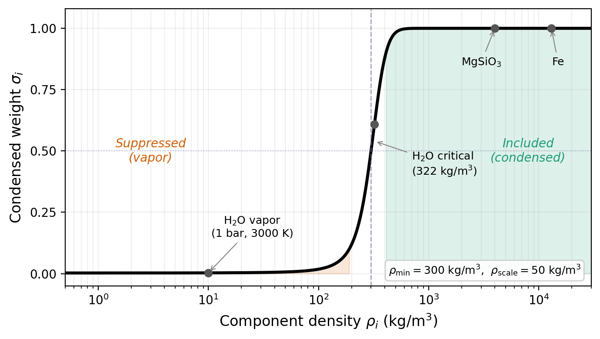

# Multi-Material Mixing

This page documents how Zalmoxis handles layers containing multiple materials, including the phase-aware density suppression that prevents non-condensed volatiles from dominating the mixture.
For configuration syntax, see the [configuration guide](../How-to/configuration.md#multi-material-mixing).
For the governing equations and layer architecture, see the [model overview](model.md).

---

## Volume-additive mixing

When a layer contains multiple materials (e.g., `"PALEOS:MgSiO3:0.85+PALEOS:H2O:0.15"`), the density at each radial shell is computed from the individual component densities at the local $(P, T)$.
Single-component layers use the component's density directly with no mixing overhead.

For multi-component layers, the standard volume-additive (ideal mixing) harmonic mean is:

$$
\rho_{\mathrm{mix}} = \left( \sum_i \frac{w_i}{\rho_i} \right)^{-1}
$$

where $w_i$ are mass fractions and $\rho_i(P, T)$ is each component's density evaluated independently from its own EOS table.
This assumes that partial specific volumes add linearly (no excess volume of mixing).

---

## Harmonic mean sensitivity to low-density components

The harmonic mean is dominated by the lightest component: even a small mass fraction of a low-density material can reduce $\rho_{\mathrm{mix}}$ dramatically.
At high temperatures and low pressures (near the planetary surface), H$_2$O transitions from condensed phases (liquid, ice) to vapor or low-density supercritical fluid with $\rho \sim 10$ to $100$ kg/m$^3$.
In a rock-water mixture with 85% MgSiO$_3$ ($\rho \sim 4000$ kg/m$^3$) and 15% H$_2$O ($\rho \sim 50$ kg/m$^3$), the standard harmonic mean gives $\rho_{\mathrm{mix}} \approx 311$ kg/m$^3$, far below the rock density that should dominate structurally.
The low-density vapor effectively inflates the planet's radius, producing non-physical results (e.g., $R \sim 24\,R_\oplus$ for a 10 $M_\oplus$ planet that should be $R \sim 2\,R_\oplus$).

Iron ($\rho > 7000$ kg/m$^3$) and MgSiO$_3$ ($\rho > 2500$ kg/m$^3$) exist only in condensed phases within the PALEOS tables and never trigger this problem.
Only H$_2$O (and, in future, other volatiles like CO$_2$, NH$_3$, H$_2$, He) has gas-phase states in the EOS tables.

---

## Sigmoid-weighted suppression of non-condensed components

*Condensed weight $\sigma_i$ as a function of component density. Low-density phases (vapor, supercritical gas) are smoothly suppressed; condensed phases (liquid, solid, rock, iron) are fully included. The sigmoid center is set near the H$_2$O critical density (322 kg/m$^3$).*

To prevent non-condensed volatiles from dominating the harmonic mean, each component's contribution is weighted by a smooth sigmoid function of its density:

$$
\sigma_i = \frac{1}{1 + \exp\!\left( -\frac{\rho_i - \rho_{\mathrm{min}}}{\rho_{\mathrm{scale}}} \right)}
$$

where $\rho_{\mathrm{min}}$ is the sigmoid center and $\rho_{\mathrm{scale}}$ controls the transition width.
The suppressed harmonic mean becomes:

$$
\rho_{\mathrm{mix}} = \frac{\sum_i w_i \, \sigma_i}{\sum_i w_i \, \sigma_i / \rho_i}
$$

This formulation has two key properties:

1. **When all $\sigma_i \approx 1$** (all components condensed), the expression reduces exactly to the standard harmonic mean.
   For iron ($\rho > 7000$) and MgSiO$_3$ ($\rho > 2500$), the sigmoid returns $\sigma \approx 1.0$ to machine precision, so existing single-material and all-condensed configurations produce numerically identical results.

2. **When $\sigma_i \to 0$** (component is vapor-like), both the numerator and denominator lose the $i$-th term proportionally, and the component drops out smoothly.
   There is no discontinuity, which is important for the adaptive ODE solver (RK45) that requires smooth right-hand-side functions.

The same sigmoid weighting is applied to the adiabatic gradient $\nabla_{\mathrm{ad}}$: components that are suppressed in the density calculation are also suppressed in the temperature profile calculation, maintaining internal consistency.

---

## Sigmoid parameters

The default parameters are calibrated for H$_2$O:

| Parameter | Default | Physical meaning |
|---|---|---|
| `condensed_rho_min` | 322 kg/m$^3$ | Sigmoid center = H$_2$O critical density (647 K, 22.1 MPa) |
| `condensed_rho_scale` | 50 kg/m$^3$ | Transition width; $\sigma$ goes from 0.02 to 0.98 over a range of about 390 kg/m$^3$ (~8$\times$ the scale) |

Behavior at representative densities:

| Density (kg/m$^3$) | Phase example | $\sigma$ |
|---|---|---|
| 10 | H$_2$O vapor at 1 bar, 3000 K | 0.002 |
| 100 | H$_2$O low-density supercritical | 0.012 |
| 322 | H$_2$O critical density (sigmoid center) | 0.500 |
| 500 | Dense supercritical H$_2$O | 0.972 |
| 1000 | Liquid H$_2$O at high $P$ | 1.000 |
| 4000 | MgSiO$_3$ | 1.000 |
| 13000 | Fe | 1.000 |

For H$_2$O, the defaults are appropriate.
For other volatiles, the code sets per-component values automatically (see table below).
The global `condensed_rho_min` and `condensed_rho_scale` parameters in the TOML config serve as fallbacks for any component not in the internal lookup table.

### Per-component defaults

| EOS component | `condensed_rho_min` (kg/m$^3$) | `condensed_rho_scale` (kg/m$^3$) | Physical basis |
|---|---|---|---|
| `Chabrier:H` | 30 | 10 | H$_2$ critical density (~31 kg/m$^3$). Narrow transition because the condensed/gas boundary is sharp. |
| `PALEOS:H2O` | 322 | 50 (global) | H$_2$O critical density (647 K, 22.1 MPa). |
| `Seager2007:H2O` | 322 | 50 (global) | Same as above. |
| All others | global config value | global config value | Iron and MgSiO$_3$ always have $\rho > 2500$ kg/m$^3$; the sigmoid returns $\sigma \approx 1.0$ to machine precision. |

Both the global fallback parameters are user-configurable in the `[EOS]` section of the TOML file (see [configuration](../How-to/configuration.md#phase-aware-mixing-parameters-multi-material-only)).

---

## Physical interpretation and known limitations

The suppressed harmonic mean is a pragmatic approximation, not a thermodynamically rigorous mixing model.
Several limitations should be understood when interpreting results:

### Mass non-conservation

When a component is suppressed ($\sigma \to 0$), its mass is excluded from the structural density calculation.
This is equivalent to treating vapor-phase volatiles as having negligible structural contribution, effectively discarding their mass from the hydrostatic equilibrium.
The approximation is valid when the suppressed fraction is small and the vapor does not contribute meaningfully to hydrostatic support.
For a mantle with 15% H$_2$O by mass, suppression primarily affects the outermost shells where pressure is low enough for H$_2$O to be vapor-like; at depth, the H$_2$O is condensed and fully included.

### Temperature profile consistency

The same suppression is applied to $\nabla_{\mathrm{ad}}$: when a component is suppressed in the density, its adiabatic gradient is also suppressed.
This means the temperature profile ignores the thermodynamic contribution of vapor-phase volatiles.
In reality, vapor affects heat transport and the temperature gradient.
This approximation is self-consistent within the model (the density and temperature calculations "see" the same effective mixture) but differs from the physical situation where vapor is present and thermodynamically active.

### Density-based criterion avoids phase-label ambiguity

Unlike approaches that classify each EOS grid cell as "condensed" or "non-condensed" using phase labels, the sigmoid operates on density alone.
This avoids ambiguity in the supercritical regime, where phase labels like "supercritical" span a wide range of densities: supercritical H$_2$O at 10 GPa and 3000 K has $\rho \sim 1200$ to $1400$ kg/m$^3$ (dense, liquid-like, correctly included), while supercritical H$_2$O at 1 bar and 3000 K has $\rho \sim 1$ kg/m$^3$ (gas-like, correctly suppressed).
A density-based criterion handles this naturally without consulting phase tables.

---

## Binodal (miscibility) suppression for sub-Neptune interiors

When H$_2$ is mixed with silicate or water (e.g., `"PALEOS:MgSiO3:0.97+Chabrier:H:0.03"`), a density-based sigmoid alone is insufficient.
H$_2$ may be dense enough to pass the density sigmoid (especially at high pressures), yet still be thermodynamically immiscible with its partner material below the miscibility boundary (the binodal).
A second sigmoid, based on the binodal temperature, determines whether H$_2$ participates in the structural density.

The total suppression weight for an H$_2$ component is the product of both sigmoids:

$$
\sigma_{\mathrm{total}} = \sigma_{\mathrm{density}} \times \sigma_{\mathrm{binodal}}
$$

where $\sigma_{\mathrm{density}}$ is the density-based sigmoid described above, and $\sigma_{\mathrm{binodal}}$ is the binodal (miscibility) sigmoid.
When the temperature is above the binodal, $\sigma_{\mathrm{binodal}} \approx 1$ and H$_2$ is included.
When below, $\sigma_{\mathrm{binodal}} \to 0$ and H$_2$ is excluded.
The transition is smooth, controlled by the `binodal_T_scale` parameter (default 50 K, giving a ~200 K transition zone).

Two independent binodal models are available. Both are evaluated automatically when `Chabrier:H` is present in a mixture. The most restrictive (lowest) suppression weight wins.
For the full physics, see the [binodal documentation](binodal.md).

### H$_2$-MgSiO$_3$ miscibility: Rogers+2025

The H$_2$-MgSiO$_3$ binodal from [Rogers, Young & Schlichting (2025, MNRAS 544, 3496)](https://doi.org/10.1093/mnras/stae2268) defines the phase boundary between a miscible supercritical fluid (above) and immiscible gas + melt (below).
The binodal temperature varies with H$_2$ mole fraction and pressure:

- At 1 GPa, the peak binodal temperature is ~4100 K (at the critical mole fraction $x_c = 0.74$).
- At 10 GPa, it drops to ~3000 K (higher pressure promotes mixing).
- Above 35 GPa, H$_2$ and MgSiO$_3$ are always miscible ($T_c \leq 0$).

This model applies when `Chabrier:H` coexists with any MgSiO$_3$ EOS in the same layer.

### H$_2$-H$_2$O miscibility: Gupta+2025

The H$_2$-H$_2$O critical curve from [Gupta, Stixrude & Schlichting (2025, ApJL 982, L35)](https://doi.org/10.3847/2041-8213/adb8f5) uses an asymmetric Margules Gibbs free energy model.
The critical temperature depends on pressure (via the interaction parameter $W(T, P)$).

A floor of 647 K is imposed on the critical temperature.
Below 647 K, H$_2$O condenses to liquid or ice, and the Margules model (fitted to supercritical DFT-MD data) is not valid.
H$_2$ and condensed H$_2$O are always immiscible, so the floor ensures correct suppression for cold sub-Neptune models with condensed water layers.

This model applies when `Chabrier:H` coexists with any H$_2$O EOS in the same layer.

---

## Future extensions

The mixing framework supports several planned extensions without requiring changes to the upstream solver code:

- Depth-dependent fractions via the `LayerMixture.update_fractions()` interface (already supported for PROTEUS/CALLIOPE coupling).
- Non-ideal mixing corrections (excess volume) in `calculate_mixed_density()`.
- Additional volatile EOS (He, CO$_2$, NH$_3$) with their own per-component sigmoid parameters.
