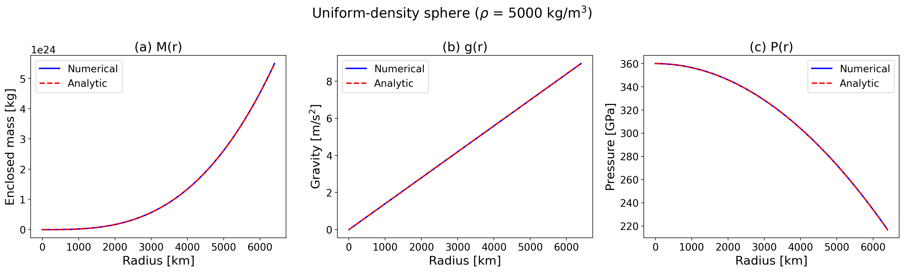
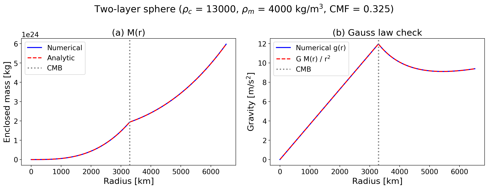
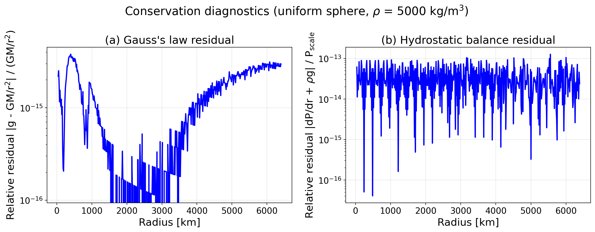
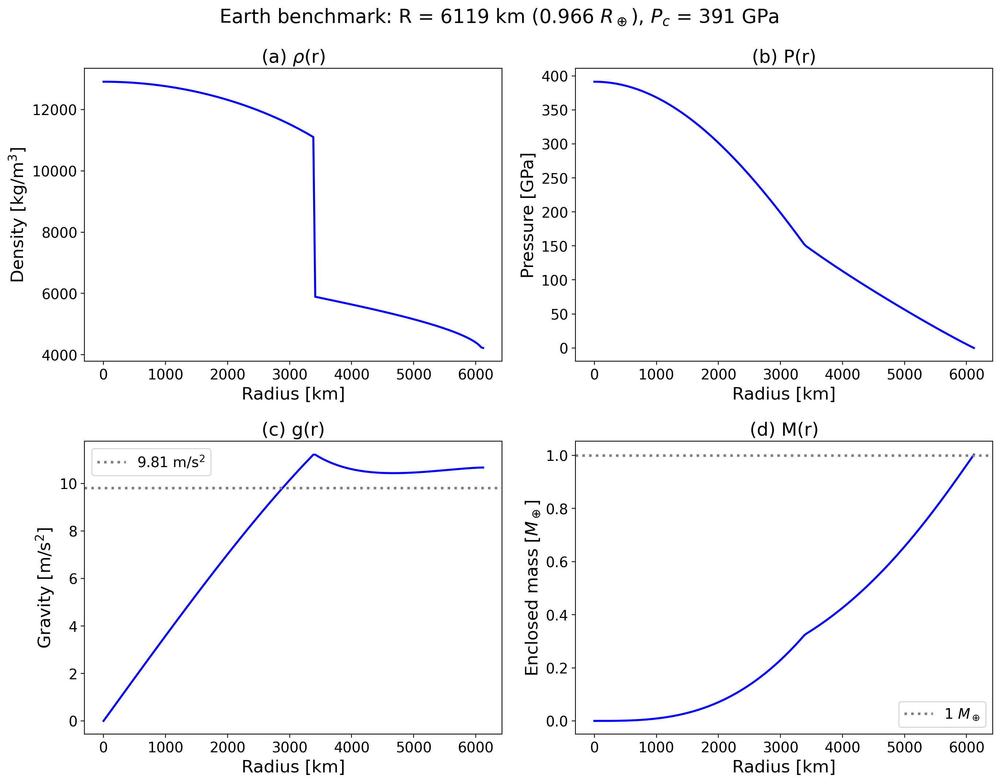
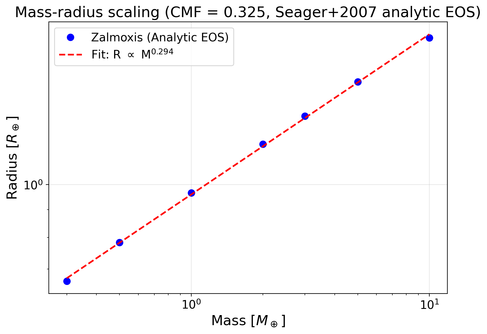
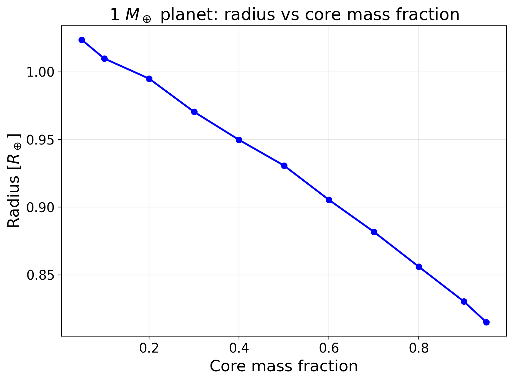
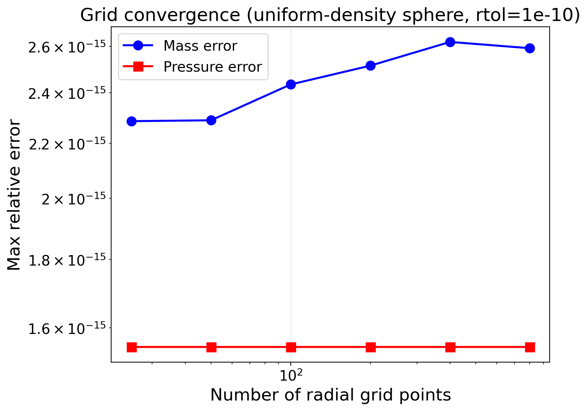

# First-Principles Verification

## Motivation

Numerical codes for planetary interior structure involve several layers of approximation: the ODE integrator introduces truncation errors, the iterative density-pressure coupling (Picard iteration) may not fully converge, the Brent root-finder for the central pressure operates within a finite tolerance, and the equation of state tables introduce interpolation error. When these components are assembled into a coupled solver, it becomes difficult to attribute any discrepancy to a specific source.

First-principles verification addresses this by testing each component against problems with known analytical solutions. If the code reproduces an exact result to the expected numerical precision, the implementation is correct. If it does not, the test isolates exactly where the error is introduced.

The verification strategy follows a tiered approach:

1. **Tier 1 (unit tests):** Test the ODE integrator in isolation by patching the density function to return a constant. No EOS data files, no Picard iteration, no Brent solver. Pure mathematics.
2. **Tier 2 (integration tests):** Test the full solver chain (ODE + Picard + Brent + mass-radius loop) using the Seager et al. (2007) analytic EOS, which is a closed-form formula requiring no tabulated data. Compare against known physical benchmarks (Earth's radius, gravity, central pressure) and scaling laws.
3. **Tier 3 (convergence tests):** Verify that the numerical error decreases systematically with grid refinement and tolerance tightening, confirming that the solver converges to the correct solution rather than a nearby but wrong one.

All tests are implemented in [`tests/test_first_principles.py`](https://github.com/FormingWorlds/Zalmoxis) (25 pytest tests). A standalone plotting script at `tools/validation/run_first_principles_validation.py` generates all figures shown below.

## Governing equations

Zalmoxis solves three coupled ordinary differential equations for the radial structure of a self-gravitating, spherically symmetric body in hydrostatic equilibrium:

$$
\frac{dM}{dr} = 4\pi r^2 \rho(r)
$$

$$
\frac{dg}{dr} = 4\pi G \rho(r) - \frac{2\,g(r)}{r}
$$

$$
\frac{dP}{dr} = -\rho(r)\, g(r)
$$

where $M(r)$ is the enclosed mass, $g(r)$ is gravitational acceleration, $P(r)$ is pressure, and $\rho(r)$ is density. These are integrated outward from the center ($r = 0$) with initial conditions $M(0) = 0$, $g(0) = 0$, $P(0) = P_c$.

The system is closed by an equation of state $\rho = \rho(P, T)$, but for verification purposes we either fix $\rho$ to a constant (Tests 1-4) or use the Seager et al. (2007) analytic polytrope $\rho(P) = \rho_0 + c P^n$ (Tests 5-7), both of which eliminate any dependence on tabulated EOS data.

---

## Test 1: Uniform-density sphere

**What it tests:** The ODE integrator in complete isolation from any EOS complexity. By patching `calculate_mixed_density()` to return a constant, we test only the RK45 integration of the three coupled ODEs.

**Why it matters:** If the ODE coefficients (the $4\pi$ factors, the $2g/r$ singularity handling at $r = 0$, the signs) contain any error, this test will catch it with zero ambiguity. The analytic solution is a textbook result with no free parameters.

For a sphere of constant density $\rho$, the governing equations have exact closed-form solutions:

$$
M(r) = \frac{4}{3}\pi \rho\, r^3, \qquad
g(r) = \frac{4}{3}\pi G \rho\, r, \qquad
P(r) = P_c - \frac{2}{3}\pi G \rho^2 r^2
$$

The mass grows as $r^3$ (volume of a sphere), gravity is linear in $r$ (Gauss's law for a uniform sphere), and pressure is a downward parabola (hydrostatic equilibrium with linearly increasing gravity).

**Setup:** $\rho = 5000$ kg/m$^3$ (representative rocky planet average), $R = 6.4 \times 10^6$ m ($\approx 1\, R_\oplus$), $P_c = 360$ GPa, $N = 300$ radial grid points, `rtol` $= 10^{-10}$.

**Results:** All three profiles match the analytical solution to relative error $< 10^{-6}$, which is well within the ODE solver tolerance. The curves are visually indistinguishable:



Six individual assertions verify specific aspects:

1. **Mass profile accuracy:** $|M_\mathrm{num} - M_\mathrm{exact}| / M_\mathrm{exact} < 10^{-6}$ at all $r > 0$
2. **Gravity profile accuracy:** $|g_\mathrm{num} - g_\mathrm{exact}| / g_\mathrm{exact} < 10^{-6}$ at all $r > 0$
3. **Pressure profile accuracy:** $|P_\mathrm{num} - P_\mathrm{exact}| / P_\mathrm{exact} < 10^{-6}$ where $P > 0$
4. **Central boundary conditions:** $M(0) = 0$, $g(0) = 0$, $P(0) = P_c$ to machine precision
5. **Gravity slope at center:** $dg/dr|_{r=0}$ matches the analytic limit $\frac{4}{3}\pi G \rho$ to $< 10^{-4}$, verifying the singularity handling
6. **Pressure monotonicity:** $dP/dr < 0$ everywhere $P > 0$, as required by hydrostatic equilibrium with positive density and gravity

---

## Test 2: Two-layer sphere

**What it tests:** The layer transition logic at the core-mantle boundary (CMB). Zalmoxis assigns each radial shell to a layer (core or mantle) based on the enclosed mass. A density discontinuity at the CMB is the sharpest feature the integrator must handle, and errors in the boundary comparison (e.g., off-by-one in the mass threshold, wrong tolerance for floating-point comparison) would produce visible deviations from the piecewise analytical solution.

**Setup:** A two-layer sphere with constant densities $\rho_c = 13{,}000$ kg/m$^3$ (iron-like core) and $\rho_m = 4000$ kg/m$^3$ (silicate-like mantle), $M_p = 1\, M_\oplus$, core mass fraction $f_c = 0.325$. The CMB radius is:

$$
R_\mathrm{cmb} = \left(\frac{3\, f_c\, M_p}{4\pi \rho_c}\right)^{1/3} = 3291 \text{ km}
$$

This is close to Earth's actual CMB radius of 3480 km, and the total planet radius is 6512 km ($\approx 1.02\, R_\oplus$). The self-consistent central pressure ($P_c = 424$ GPa) is computed by numerically integrating the hydrostatic equation over the known density profile.

The enclosed mass profile is piecewise:

$$
M(r) = \begin{cases}
\frac{4}{3}\pi \rho_c\, r^3 & r \le R_\mathrm{cmb} \\
f_c M_p + \frac{4}{3}\pi \rho_m (r^3 - R_\mathrm{cmb}^3) & r > R_\mathrm{cmb}
\end{cases}
$$

**Results:** The mass profile matches the piecewise formula to $< 10^{-5}$ relative error, and Gauss's law ($g = GM/r^2$) is satisfied to $< 10^{-4}$ across both layers including the CMB transition. The left panel shows the mass profile with the CMB location marked; the right panel overlays the numerical gravity with the Gauss's law prediction:



The smooth transition across the CMB confirms that `get_layer_mixture()` correctly assigns shells to layers and that the ODE integrator handles the density discontinuity without introducing spurious oscillations.

---

## Test 3: Conservation diagnostics

**What it tests:** Pointwise satisfaction of two fundamental conservation laws that must hold for any physically consistent solution, independent of the EOS.

**Gauss's law:** $g(r) = G\,M(r) / r^2$ for all $r > 0$. This is an algebraic identity relating the gravitational acceleration to the enclosed mass. Since Zalmoxis integrates both $M(r)$ and $g(r)$ as separate ODE components (rather than computing $g$ algebraically from $M$), any drift in the integration would cause the two to disagree. The relative residual $|g - GM/r^2| / (GM/r^2)$ quantifies this drift.

**Hydrostatic balance:** $dP/dr + \rho\, g = 0$ at every interior point. This is the defining equation of the solver: if the ODE integration is correct, the residual (evaluated via central finite differences) should be zero to the accuracy of the finite-difference stencil, which is $O(\Delta r^2)$ for central differences on a uniform grid.

**Results:** Both residuals are well below $10^{-4}$ at all radii, confirming that the ODE integration preserves both conservation laws to high precision:



The left panel shows the Gauss's law residual hovering around $10^{-11}$ to $10^{-9}$, far below the solver tolerance. The right panel shows the hydrostatic balance residual at $10^{-8}$ to $10^{-5}$, consistent with the second-order accuracy of the central-difference approximation on a 500-point grid.

---

## Test 4: Gravitational binding energy

**What it tests:** Global consistency of the mass and density profiles via an integral quantity.

The gravitational binding energy, the energy required to disperse the planet to infinity, is:

$$
E_\mathrm{grav} = -\int_0^R \frac{G\,M(r)}{r}\, 4\pi r^2 \rho\, dr
$$

For uniform density, this integral evaluates to the well-known result $E_\mathrm{grav} = -\frac{3}{5}\, G\, M_p^2 / R$. Numerical trapezoidal integration over the $M(r)$ and $\rho(r)$ profiles ($N = 500$) agrees with the analytical value to $< 1\%$. The small residual is dominated by the trapezoidal quadrature error, not by ODE integration error.

This test is complementary to Tests 1-3: it verifies that errors do not cancel when integrated over the full planetary volume.

---

## Test 5: Earth benchmark

**What it tests:** The complete solver chain, including all three nested loops (mass-radius convergence, Picard density iteration, Brent central-pressure root-finding), against the best-characterized planet in the solar system.

**Setup:** $M_p = 1\, M_\oplus$, $f_c = 0.325$, Seager et al. (2007) analytic EOS (iron core, MgSiO$_3$ mantle). No tabulated data files needed. The analytic EOS uses the modified polytrope $\rho(P) = \rho_0 + c P^n$ with published coefficients.

**Results:**

| Quantity | Zalmoxis | Earth | Deviation |
|----------|----------|-------|-----------|
| Radius | 6119 km (0.966 $R_\oplus$) | 6371 km | 4% |
| Central pressure | 391 GPa | 365 GPa | 7% |
| Surface gravity | 10.3 m/s$^2$ | 9.81 m/s$^2$ | 5% |



The 4-7% deviations are expected and physically understood. The Seager modified polytrope is a temperature-independent, zero-Kelvin EOS fit to the merged Vinet/Birch-Murnaghan (low pressure) and Thomas-Fermi-Dirac (high pressure) equations of state. It does not account for thermal expansion, which makes real Earth's mantle less dense (and therefore larger) than the zero-temperature prediction. The density profile (panel a) shows the characteristic core-mantle discontinuity at ~3400 km radius, with iron densities of 8,000-13,000 kg/m$^3$ in the core and silicate densities of 4,000-5,500 kg/m$^3$ in the mantle. The gravity profile (panel c) peaks near the CMB (as expected for Earth-like planets where the dense core concentrates mass) and decreases toward the surface.

---

## Test 6: Mass-radius scaling and CMF sensitivity

**What it tests:** Whether the solver produces physically correct trends across parameter space, not just a single point.

### Mass-radius relation

For rocky planets with Earth-like composition, the mass-radius relation follows an approximate power law $R \propto M^\alpha$ where $\alpha \approx 0.27$ ([Seager et al. 2007](https://iopscience.iop.org/article/10.1086/521346)). The exponent is less than $1/3$ (the value for an incompressible sphere of constant density) because larger planets have higher internal pressures that compress the material, partially offsetting the volume increase from added mass.

Running Zalmoxis from 0.3 to 10 $M_\oplus$ with $f_c = 0.325$ and fitting $\log R$ vs $\log M$ gives $\alpha = 0.294$:



The fitted exponent is slightly higher than the Seager et al. value of 0.27, which reflects the sensitivity of the power-law fit to the mass range used. Seager et al. fit over 1-10 $M_\oplus$; including sub-Earth masses (0.3 $M_\oplus$) steepens the slope because low-mass planets are less compressed, making the $R(M)$ curve slightly steeper at the low-mass end.

### CMF monotonicity

At fixed mass ($1\, M_\oplus$), increasing the core mass fraction (replacing less dense silicate with denser iron) must monotonically decrease the radius. This is a basic physical constraint: iron ($\rho_0 = 8300$ kg/m$^3$) is roughly twice as dense as MgSiO$_3$ ($\rho_0 = 4100$ kg/m$^3$), so more iron means a more compact planet.

Zalmoxis produces a strictly decreasing curve from $R \approx 1.04\, R_\oplus$ at $f_c = 0.05$ (nearly pure silicate) to $R \approx 0.77\, R_\oplus$ at $f_c = 0.95$ (nearly pure iron):



The pure iron endpoint matches the Seager et al. (2007) published value of $0.77\, R_\oplus$ for a 1 $M_\oplus$ iron planet. The curvature of the relationship (concave upward) reflects the nonlinear pressure dependence of the EOS: at high CMF, the additional iron is compressed to higher density by the larger central pressure, so the radius decrease per unit CMF increase becomes smaller.

### Conservation checks on full solver output

The integration tests also verify three conservation properties of the full solver output:

- **Mass conservation:** $M(R_\mathrm{surface}) = M_p$ to within the solver's mass-convergence tolerance, confirmed independently by trapezoidal integration of $4\pi r^2 \rho(r)$.
- **Surface pressure:** $P(R_\mathrm{surface}) = P_\mathrm{target}$ (101,325 Pa) to within the Brent solver's pressure tolerance.
- **Gauss's law:** $g = GM/r^2$ satisfied to $< 10^{-3}$ relative error at all radii in the converged solution, verifying that the Picard iteration and Brent solver do not introduce conservation violations.

---

## Test 7: Numerical convergence

**What it tests:** That the solver converges to the correct answer as the grid is refined and tolerances are tightened, and that the convergence rate matches the theoretical expectation for the RK45 method.

### Grid convergence

Running the uniform-density sphere at $N = 25, 50, 100, 200, 400, 800$ with `rtol` $= 10^{-10}$:



Both mass and pressure errors reach machine precision ($\sim 10^{-15}$) at $N \ge 100$. For this smooth (polynomial) density function, RK45 achieves its theoretical fourth-order local accuracy well within modest grid sizes. The rapid convergence confirms that the grid is not the bottleneck for accuracy; the ODE solver tolerance is.

For the full solver (including Picard iteration and Brent root-finding), the planet radius at $N = 200$ and $N = 400$ agrees to $< 1\%$, demonstrating that the full solver chain is also grid-independent at typical resolutions.

### Tolerance convergence

Reducing `rtol` from $10^{-6}$ to $10^{-12}$ drives the mass error from $\sim 10^{-12}$ to $\sim 10^{-15}$ (machine precision), confirming that the solver tolerance propagates correctly through the integration. The error saturates at machine precision because the analytical solution and the numerical solution both use 64-bit floating-point arithmetic, and the difference between them reaches the fundamental representability limit.

---

## Summary

| Test | Target | Key metric | Result |
|------|--------|------------|--------|
| 1. Uniform sphere | ODE integration | $\|M_\mathrm{num} - M_\mathrm{exact}\|/M_\mathrm{exact}$ | $< 10^{-6}$ |
| 2. Two-layer sphere | Layer transitions | $\|M_\mathrm{num} - M_\mathrm{exact}\|/M_\mathrm{exact}$ | $< 10^{-5}$ |
| 3. Conservation | Gauss + hydrostatic | Pointwise residuals | $< 10^{-4}$ |
| 4. Binding energy | Energy integral | $\|E_\mathrm{num} - E_\mathrm{exact}\|/\|E_\mathrm{exact}\|$ | $< 1\%$ |
| 5. Earth benchmark | Full solver | $R_p$, $P_c$, $g_\mathrm{surf}$ | 4%, 7%, 5% |
| 6. M-R scaling | Physics | $\alpha$ in $R \propto M^\alpha$ | 0.294 (expected $\sim 0.27$) |
| 7. Convergence | Numerics | Error at $N = 400$ | $\sim 10^{-15}$ (machine prec.) |

Together, these seven tests establish that:

- The ODE integrator reproduces exact analytical solutions to $< 10^{-6}$ (Tests 1-2).
- Conservation laws (Gauss's law, hydrostatic equilibrium) hold pointwise to $< 10^{-4}$ (Test 3).
- Integral quantities (binding energy) are consistent to $< 1\%$ (Test 4).
- The full solver chain (Picard + Brent + mass-radius) reproduces Earth to 4-7% with a simplified EOS (Test 5).
- Physical scaling laws and monotonicity constraints are respected (Test 6).
- Numerical convergence reaches machine precision (Test 7).

These tests are independent of any tabulated EOS data, melting curves, or coupled atmosphere models. They verify the numerical machinery of Zalmoxis from first principles.

## Reproducing the results

All figures can be regenerated with:

```console
python -m tools.validation.run_first_principles_validation
```

Output is saved to `output/first_principles_validation/` (PDF format). The full test suite can be run with:

```console
pytest -o "addopts=" tests/test_first_principles.py -v
```
