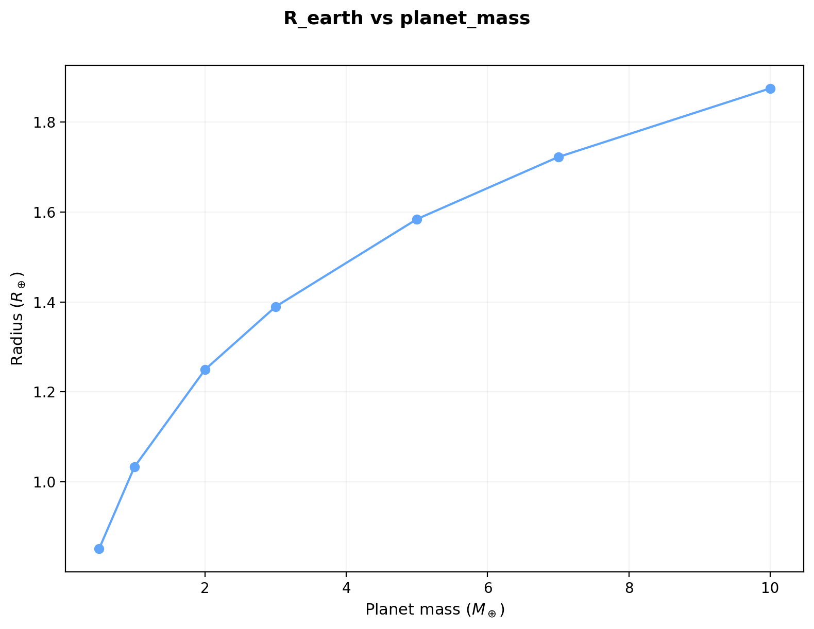
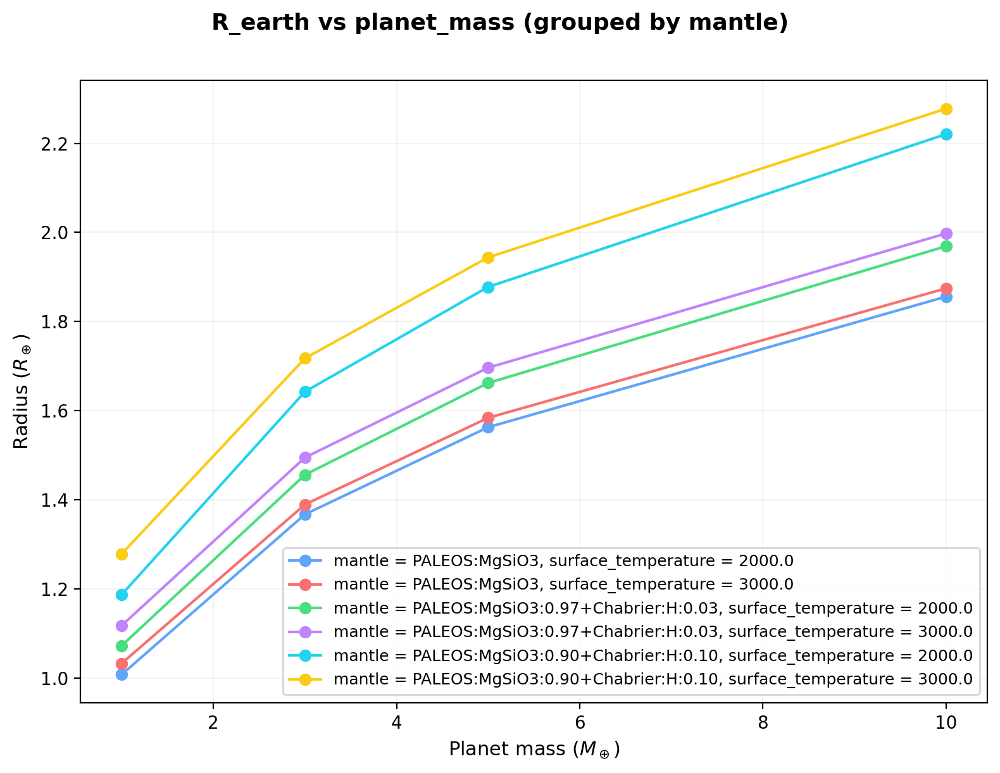
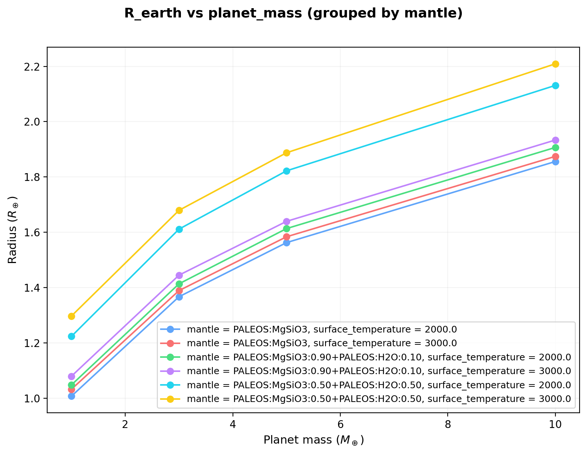
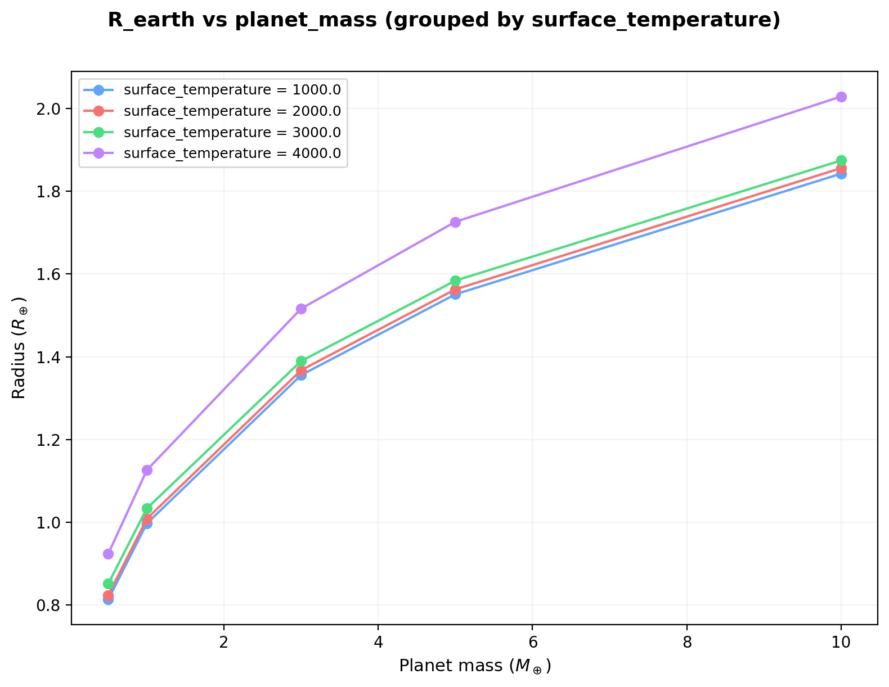

# Parameter grids

To sweep over any combination of parameters, use the grid runner with a TOML specification file:

```console
python -m tools.grids.run_grid <grid.toml> -j <workers>
```

The `-j` flag sets the number of parallel workers (default: 1, serial execution).

## Grid TOML format

A grid TOML file has three sections:

```toml
[base]
config = "input/default.toml"  # base config (relative to ZALMOXIS_ROOT)

[sweep]
# Each key is a parameter name, each value is a list to sweep over.
# The runner generates the Cartesian product of all sweep parameters.
planet_mass = [0.5, 1.0, 3.0, 5.0, 10.0]
surface_temperature = [1000, 2000, 3000]

[output]
dir = "output/grid_results"  # output directory (relative to ZALMOXIS_ROOT)
```

The available sweep parameter names and their mapping to TOML config sections are:

| Sweep parameter | Config section | Config key |
|---|---|---|
| `planet_mass` | `[InputParameter]` | `planet_mass` |
| `core_mass_fraction` | `[AssumptionsAndInitialGuesses]` | `core_mass_fraction` |
| `mantle_mass_fraction` | `[AssumptionsAndInitialGuesses]` | `mantle_mass_fraction` |
| `temperature_mode` | `[AssumptionsAndInitialGuesses]` | `temperature_mode` |
| `surface_temperature` | `[AssumptionsAndInitialGuesses]` | `surface_temperature` |
| `center_temperature` | `[AssumptionsAndInitialGuesses]` | `center_temperature` |
| `core` | `[EOS]` | `core` |
| `mantle` | `[EOS]` | `mantle` |
| `ice_layer` | `[EOS]` | `ice_layer` |
| `condensed_rho_min` | `[EOS]` | `condensed_rho_min` |
| `condensed_rho_scale` | `[EOS]` | `condensed_rho_scale` |
| `binodal_T_scale` | `[EOS]` | `binodal_T_scale` |
| `mushy_zone_factor` | `[EOS]` | `mushy_zone_factor` |
| `rock_solidus` | `[EOS]` | `rock_solidus` |
| `rock_liquidus` | `[EOS]` | `rock_liquidus` |
| `num_layers` | `[Calculations]` | `num_layers` |

## Example: mass-radius curve

Sweep planet mass to build a mass-radius relation for rocky planets (file: `input/grids/mass_radius.toml`):

```toml
[base]
config = "input/default.toml"

[sweep]
planet_mass = [0.5, 1.0, 2.0, 3.0, 5.0, 7.0, 10.0]

[output]
dir = "output/grid_mass_radius"
```

Run with 2 workers:

```console
python -m tools.grids.run_grid input/grids/mass_radius.toml -j 2
```

The resulting mass-radius relation for a PALEOS iron core + MgSiO3 mantle planet (32.5% core mass fraction, adiabatic temperature at $T_s$ = 3000 K):



## Example: H$_2$ mixing grid

Sweep planet mass, mantle composition, and surface temperature to explore the effect of dissolved hydrogen on planet radius (file: `input/grids/h2_mixing.toml`):

```toml
[base]
config = "input/default.toml"

[sweep]
planet_mass = [1.0, 3.0, 5.0, 10.0]
mantle = ["PALEOS:MgSiO3", "PALEOS:MgSiO3:0.97+Chabrier:H:0.03", "PALEOS:MgSiO3:0.90+Chabrier:H:0.10"]
surface_temperature = [2000, 3000]

[output]
dir = "output/grid_h2_mixing"
```

This produces 4 x 3 x 2 = 24 models. Plotting with `--single-panel` shows how dissolved hydrogen inflates the radius at fixed mass:



At higher H$_2$ mass fractions, the lower mean density of the mixed mantle leads to larger radii, with the effect increasing at higher masses where the mantle constitutes a larger fraction of the planet volume.

## Example: H$_2$O mixing grid

Sweep planet mass and mantle water content to explore the effect of water on planet radius (file: `input/grids/h2o_mixing.toml`):

```toml
[base]
config = "input/default.toml"

[sweep]
planet_mass = [1.0, 3.0, 5.0, 10.0]
mantle = ["PALEOS:MgSiO3", "PALEOS:MgSiO3:0.90+PALEOS:H2O:0.10", "PALEOS:MgSiO3:0.50+PALEOS:H2O:0.50"]
surface_temperature = [2000, 3000]

[output]
dir = "output/grid_h2o_mixing"
```

This produces 4 x 3 x 2 = 24 models. Plotting with `--single-panel` shows the radius increase from water in the mantle:



## Example: varying temperature and planet mass

Sweep surface temperature and planet mass to explore thermal expansion effects on radius (file: `input/grids/mass_temperature.toml`):

```toml
[base]
config = "input/default.toml"

[sweep]
planet_mass = [0.5, 1.0, 3.0, 5.0, 10.0]
surface_temperature = [1000, 2000, 3000, 4000]

[output]
dir = "output/grid_mass_temperature"
```

This produces 5 x 4 = 20 models. Plotting with `--single-panel` overlays all temperature curves on one panel:



Higher surface temperatures lead to larger radii through thermal expansion. The effect is modest between 1000 and 3000 K but becomes significant at 4000 K, particularly at lower masses where self-compression is weaker.

## Output

Each grid run produces:

- **`grid_summary.csv`**: One row per model with columns for all sweep parameters, calculated radius (R_earth), mass (M_earth), convergence flags, wall time, and any error messages.
- **Per-run JSON files**: Individual `<label>.json` files with the same information, named by the parameter combination.

Plotting and per-profile data output are disabled during grid runs for speed. To generate plots for specific parameter combinations, run them individually with `plots_enabled = true`.

## Plotting grid results

Use `plot_grid` to visualize the results from a grid run:

```console
python -m tools.grids.plot_grid output/grid_mass_radius
```

This reads the `grid_summary.csv` in the given directory and produces a mass-radius diagram by default. You can also pass the CSV path directly:

```console
python -m tools.grids.plot_grid output/grid_mass_radius/grid_summary.csv
```

### Choosing axes

Any column in the CSV can be used as the x- or y-axis:

```console
python -m tools.grids.plot_grid output/grid_results -x surface_temperature -y R_earth
```

Available columns include all sweep parameters (`planet_mass`, `surface_temperature`, `core_mass_fraction`, etc.) and computed outputs (`R_earth`, `M_earth`, `time_s`).

### Multi-parameter grids

When the grid sweeps two or more parameters, the plotter automatically groups by the second sweep parameter and creates one subplot per group value:

```console
# 2D grid (mass x surface_temperature): one subplot per surface_temperature
python -m tools.grids.plot_grid output/grid_results
```

To override which parameter is used for grouping:

```console
python -m tools.grids.plot_grid output/grid_results -g mantle
```

To put all groups on a single panel with a color-coded legend instead of subplots:

```console
python -m tools.grids.plot_grid output/grid_results --single-panel
```

### Unconverged runs

Runs that did not converge are shown as X-shaped markers (with a separate legend entry), so they are visible but distinct from converged results. Runs that failed entirely (no radius computed) are silently skipped.

### Plot output

By default, the figure is saved in the same directory as the CSV with a descriptive filename (e.g., `grid_R_earth_vs_planet_mass.png`). To specify a different output path:

```console
python -m tools.grids.plot_grid output/grid_results -o my_plot.png
```

### Python API

The plotting function can also be called directly from Python (e.g., in a Jupyter notebook or IDE):

```python
from tools.grids.plot_grid import plot_grid_summary

# Default mass-radius plot
plot_grid_summary("output/grid_mass_radius")

# Custom axes, single panel
plot_grid_summary(
    "output/grid_results",
    x="surface_temperature",
    y="R_earth",
    group_by="mantle",
    single_panel=True,
    output="my_plot.png",
)
```

### Full CLI reference

```
python -m tools.grids.plot_grid <path> [-x COLUMN] [-y COLUMN] [-g PARAM]
                               [--single-panel] [-o FILE] [--dpi N]
```

| Flag | Default | Description |
|------|---------|-------------|
| `path` | (required) | Grid output directory or `grid_summary.csv` path |
| `-x` | `planet_mass` | Column for the x-axis |
| `-y` | `R_earth` | Column for the y-axis |
| `-g` | auto | Sweep parameter to group by |
| `--single-panel` | off | All groups on one panel |
| `-o` | auto | Output file path |
| `--dpi` | 200 | Figure resolution |
